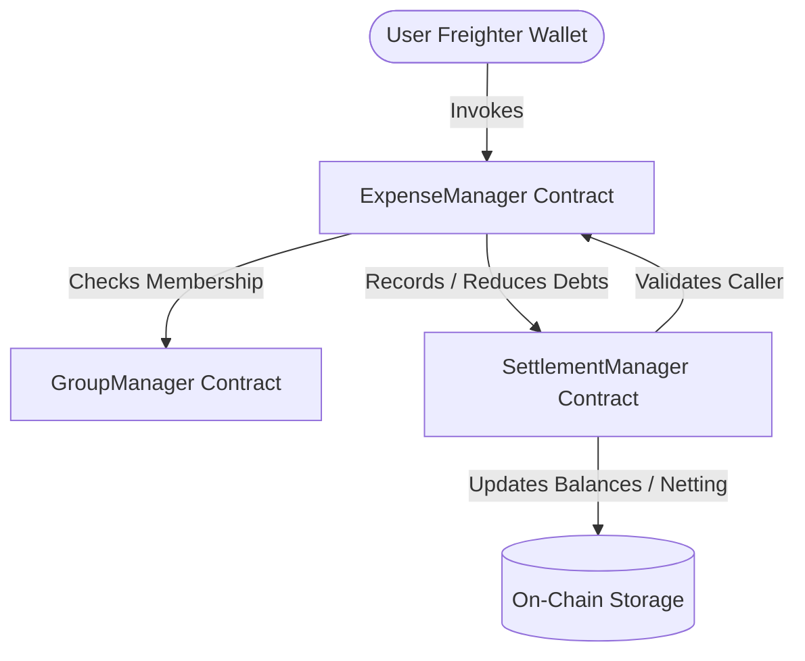

# SplitPay

> **Split Expenses. Settle Instantly.**
> A production-grade decentralized expense management and settlement dApp built on Stellar and Soroban.

---

## Table of Contents
- [Architecture & Contract Layout](#architecture--contract-layout)
- [Stellar Levels 1–4 Compliance Roadmap](#stellar-levels-14-compliance-roadmap)
- [Visual Design System](#visual-design-system)
- [Getting Started](#getting-started)
  - [Smart Contracts](#smart-contracts)
  - [Frontend Dashboard](#frontend-dashboard)
- [Smart Contract Reference](#smart-contract-reference)
- [CI/CD DevOps](#cicd-devops)

---

## Architecture & Contract Layout

SplitPay uses a multi-contract architecture on the Soroban network to separate concerns and support modular upgrades. 



1. **`GroupManager`**: Maintains group metadata, administrators, and member lists. It acts as the registry of trust.
2. **`ExpenseManager`**: Records expense events on-chain, validates split integrity (equal, percentage, custom), and calculates shares.
3. **`SettlementManager`**: Optimizes and minimizes debts via transaction netting algorithms, holds funds for on-chain settlement, and processes manual and token-based debt clearances.

---

## Stellar Levels 1–4 Compliance Roadmap

### Level 1: Basic Wallet Integration
- Integrates with the **Freighter Wallet** extension via `@stellar/freighter-api`.
- Supports fetching the active user's public key address and displaying it in the UI.
- Displays balance states and transaction lifecycle.
- Falls back gracefully to a fully featured **Local Sandbox Simulator** if the Freighter extension is not installed.

### Level 2: Interactive Soroban dApp
- The React-TypeScript dashboard offers an intuitive interface to add expenses and view group balances.
- Simulates on-chain execution by mapping frontend actions directly to contract-equivalent inputs.
- Inspects contract events and state transitions.

### Level 3: Advanced Smart Contracts & Debt Netting
- Custom error codes are mapped to prevent unauthorized modification of group data.
- Built-in **Debt Netting** algorithm running in the settlement layer:
  - Iteratively minimizes transactions to the absolute shortest path.
  - Automatically settles circular debts (e.g. if A owes B, B owes C, C owes A).
- Multi-contract authorization checks block unauthorized callers.

### Level 4: Production DevOps & Polish
- Designed under the premium **Aurelian Reserve** design tokens (obsidian stacked components, copper accents, and elegant champagne typography).
- Full Rust unit and integration test suite asserting the correctness of the split and settlement algorithms.
- **GitHub Actions CI/CD Pipeline** automatically validating all Rust contracts and compiling the Vite production bundle on push or pull request.

---

## Visual Design System

SplitPay is built with **Tailwind CSS v4** and styled according to the **Aurelian Reserve** brand guidelines:
- **Obsidian Dark Mode**: Background `#121212`, card surfaces `#1A1A1A` with a subtle `rgba(247,231,206,0.08)` border.
- **Copper Accent**: `#B87333` for highlights, primary actions, and branding moments.
- **Champagne Typography**: `#F7E7CE` for clean, readable headers.
- **Forest Green**: `#355E3B` representing positive balance states and validated ledger listings.

---

## Getting Started

### Smart Contracts

#### Prerequisites
- Rust and `cargo` installed.
- Wasm target added:
  ```bash
  rustup target add wasm32-unknown-unknown
  ```

#### Run Integration Tests
```bash
cargo test
```

#### Compile WASM Targets
```bash
cargo build --target wasm32-unknown-unknown --release
```

---

### Frontend Dashboard

#### Setup and Run
1. Navigate to the `frontend/` directory:
   ```bash
   cd frontend
   ```
2. Install Node modules:
   ```bash
   npm install
   ```
3. Run the Vite development server:
   ```bash
   npm run dev
   ```
4. Access the web dashboard at `http://localhost:5173/`.

---

## Smart Contract Reference

### `GroupManager`
- `create_group(env: Env, creator: Address, name: String) -> u32`
- `join_group(env: Env, group_id: u32, member: Address)`
- `is_member(env: Env, group_id: u32, member: Address) -> bool`

### `ExpenseManager`
- `add_expense(env: Env, group_mgr: Address, settle_mgr: Address, group_id: u32, description: String, amount: i128, paid_by: Address, split_type: u32, splits: Vec<SplitDetail>)`
- `delete_expense(env: Env, settle_mgr: Address, group_id: u32, expense_id: u32, caller: Address)`

### `SettlementManager`
- `record_debt(env: Env, caller: Address, group_id: u32, debtor: Address, creditor: Address, amount: i128)`
- `reduce_debt(env: Env, caller: Address, group_id: u32, debtor: Address, creditor: Address, amount: i128)`
- `settle_debt_manual(env: Env, group_id: u32, debtor: Address, creditor: Address, amount: i128)`

---

## CI/CD DevOps

All commits are audited automatically. The pipeline validates:
1. Compilation of all Rust contracts.
2. Verification of the 7 contract integration tests.
3. Verification of Vite frontend build bundles.


<!-- Production Checked and Verified -->
