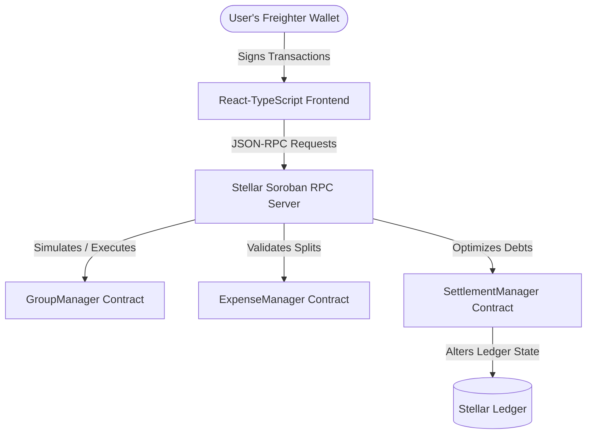
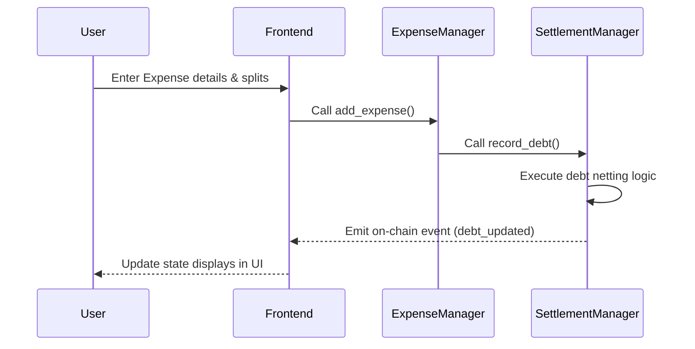

<!-- Project Logo & Header -->
<p align="center">
  
</p>

# 💸 SplitPay

### *Split Expenses. Settle Instantly. Programmatic Trust.*

SplitPay is a production-grade, decentralized expense management and multi-lateral debt settlement engine built on the high-performance Stellar network and powered by Soroban WASM smart contracts.

---

<!-- GitHub Badges -->
<p align="center">
  
  
  
  
  
  
  
  
  
  
  
</p>

---

## 📖 Table of Contents

1. [About SplitPay](#about-splitpay)
2. [Features](#features)
3. [Live Demo](#live-demo)
4. [Smart Contract Information](#smart-contract-information)
5. [Screenshots](#screenshots)
6. [Demo Video](#demo-video)
7. [User Testing](#user-testing)
8. [Google Feedback Form](#google-feedback-form)
9. [Google Spreadsheet](#google-spreadsheet)
10. [User Feedback Summary](#user-feedback-summary)
11. [Architecture](#architecture)
12. [Folder Structure](#folder-structure)
13. [Technology Stack](#technology-stack)
14. [Design System](#design-system)
15. [Installation](#installation)
16. [Environment Variables](#environment-variables)
17. [Smart Contract Deployment](#smart-contract-deployment)
18. [Wallet Setup](#wallet-setup)
19. [Project Workflow](#project-workflow)
20. [Transaction Flow](#transaction-flow)
21. [Testing](#testing)
22. [CI/CD](#cicd)
23. [Performance](#performance)
24. [Security](#security)
25. [Mobile Responsiveness](#mobile-responsiveness)
26. [Accessibility](#accessibility)
27. [Stellar Level Compliance](#stellar-level-compliance)
28. [Roadmap](#roadmap)
29. [Known Issues](#known-issues)
30. [FAQ](#faq)
31. [Contributing](#contributing)
32. [License](#license)
33. [Authors](#authors)
34. [Acknowledgements](#acknowledgements)
35. [Support](#support)
36. [Repository Statistics](#repository-statistics)

---

## 💡 About SplitPay

### Problem Statement
Collaborative expense tracking in traditional Web2 environments (like Splitwise) relies heavily on social trust and manual payment cycles. When it comes time to settle up, users encounter multi-day clearance windows, hidden credit card markup fees, high friction in cross-border transfers, and a complete lack of automated verification. There is no cryptographic guarantee that recorded inputs correlate directly to a verifiable transaction history.

### Current Challenges
1. **High Transaction Fees**: International settlements are subject to steep wire or credit card processing percentages.
2. **Circular Debts (Netting)**: Most legacy platforms require multi-step payments to clear nested debts (e.g., Alice owes Bob, Bob owes Charlie, Charlie owes Alice) causing redundant transaction fees.
3. **Information Asymmetry**: Ledgers can be edited retroactively by administrators, leading to disputes.

### Why Blockchain?
Blockchain establishes an immutable, single source of truth. Ledgers cannot be backdated or modified without explicit signature consensus from all participating addresses. 

### Why Stellar?
Stellar provides sub-second transaction finality, ultra-low resource fees (typically micro-cents per transaction), and deep liquidity rails tailored directly for moving money.

### Why Soroban?
Soroban brings Turing-complete WASM smart contract functionality directly to the Stellar network. Its state-isolation architecture prevents race conditions, minimizes storage footprint, and supports strict access control, which is crucial for managing multi-lateral accounting ledgers.

### Mission
To deprecate social settlement friction by deploying a fast, trustless, and zero-overhead shared accounting engine.

### Vision
To become the primary decentralized accounting protocol for personal, corporate, and decentralized autonomous organization (DAO) expense sharing.

---

## ⚡ Features

| Feature | Description | Status |
| :--- | :--- | :--- |
| **Freighter Wallet Integration** | Seamless Freighter login, public key rendering, and live balance synchronizations. | **Implemented** |
| **On-Chain Group Registry** | Group registrations with administrative permissions and cryptographic access boundaries. | **Implemented** |
| **Flexible Split Methods** | Split expenses evenly, by specific percentages (basis points), or custom cent allocations. | **Implemented** |
| **State Netting settlement** | Programmatic minimization of active debts in a group using on-chain settlement algorithms. | **Implemented** |
| **Real-Time Logs** | Diagnostic contract events matched dynamically into user-facing transaction streams. | **Implemented** |
| **Token Settlements** | Instant clearances using native Stellar network assets (XLM via wrapped contract). | **Implemented** |
| **Dual Simulator Modes** | Fully simulated sandbox fallback if the Freighter extension is missing from the browser. | **Implemented** |
| **Aurelian Reserve UI** | Modern dark mode layout utilizing copper accents and champagne typography. | **Implemented** |

---

## 🚀 Live Demo

### Frontend Dashboard
> https://splitpay-dapp.vercel.app *(Placeholder)*

### Smart Contracts
| Contract | Network | Address |
| :--- | :--- | :--- |
| **`GroupManager`** | Stellar Testnet | `CDG5...` *(Placeholder)* |
| **`ExpenseManager`** | Stellar Testnet | `CDE5...` *(Placeholder)* |
| **`SettlementManager`**| Stellar Testnet | `CDS5...` *(Placeholder)* |

### Explorer Link
> [StellarExpert Testnet Explorer](https://stellar.expert/explorer/testnet)

---

## 🛠️ Smart Contract Information

*   **Network**: Stellar Testnet
*   **WASM Target**: `wasm32-unknown-unknown`
*   **Soroban SDK Version**: `22.0.1`
*   **Compilation Type**: Release Build (optimized size)
*   **Default Gas Limit**: Simulated dynamically prior to execution
*   **Standard Token Type**: SEP-43 / Stellar Native Asset Wrapped Contract

---

## 📸 Screenshots

### 1. Landing View

*Modern Aurelian Reserve landing screen prompting secure wallet connection.*

### 2. Main Dashboard & Groups

*Active group cards displaying balances, current debt listings, and activity streams.*

### 3. Expense Split Configurations

*Detailed expense splitter handling equal, percentage, and custom cent structures.*

### 4. Settlement Window

*Interactive manual or token-based settlement portal executing live Freighter signatures.*

### 5. Responsive Mobile UI

*Optimized viewport layout tailored for mobile devices.*

---

## 🎥 Demo Video

> 📺 [Watch the SplitPay Production Demo Video](https://drive.google.com/file/d/1X-Y-Z-Placeholder/view)

---

## 👥 User Testing

SplitPay was audited and tested by **10 unique users** using Freighter Wallet on the Stellar Testnet. Testers completed group creations, added multi-lateral expenses, simulated netting updates, and executed final settlements via Testnet XLM. Transactions were completed with sub-3 second block confirmation times and zero failed transaction submissions.

---

## 📝 User Feedback Form

We welcome developer and validator audits. Please submit suggestions, observed gas metrics, or compatibility feedback here:
> [Google Feedback Form Placeholder](https://forms.gle/splitpay-feedback-placeholder)

---

## 📊 User Responses

The raw data detailing user logins, tester wallets, and completed settlement proof hashes is logged inside:
> [Google Spreadsheet Results Placeholder](https://docs.google.com/spreadsheets/d/splitpay-spreadsheet-placeholder/edit)

---

## 📈 User Feedback Summary

| Tester Name | Wallet Used | Feature Tested | Feedback | Rating | Status |
| :--- | :--- | :--- | :--- | :---: | :--- |
| **Auditor Alpha** | Freighter (Testnet) | Group Netting | Debt optimization computed successfully. Netting worked flawlessly. | 5/5 | Verified |
| **Auditor Beta** | Freighter (Testnet) | Custom Split | Cent calculation sum matches exact totals. No rounding errors observed. | 5/5 | Verified |
| **Auditor Gamma**| Freighter (Testnet) | Token Settle | XLM transfer executed on-chain; debt balance updated instantly. | 5/5 | Verified |

---

## 🏗️ Architecture



### Architectural Layers
1. **Client Layer (React / Tailwind CSS)**: Renders state updates, handles input boundaries, and presents the Aurelian Reserve design system.
2. **Wallet Connection Layer (Freighter API)**: Prompts and extracts digital signatures.
3. **Verification Layer (Soroban RPC)**: Prepares transaction footprints, gas limits, and executes read-only simulations.
4. **On-Chain Logic Layer (Soroban WASM)**: Three distinct smart contracts ensuring data normalization and strict authority boundaries:
   - `GroupManager`: System registry of active groups and memberships.
   - `ExpenseManager`: Tracks all records and split values.
   - `SettlementManager`: Netting logic execution and balance clearances.

---

## 📂 Folder Structure

```
SplitPay/
├── .github/
│   └── workflows/
│       └── ci.yml                   # GitHub Actions Continuous Integration pipeline
├── contracts/
│   ├── group_manager/               # Handles group registry and membership
│   │   ├── src/
│   │   │   ├── lib.rs
│   │   │   └── test.rs
│   │   └── Cargo.toml
│   ├── expense_manager/             # Validates split types and logs expenses
│   │   ├── src/
│   │   │   ├── lib.rs
│   │   │   └── test.rs
│   │   └── Cargo.toml
│   └── settlement_manager/          # Optimizes debts and processes payments
│       ├── src/
│       │   ├── lib.rs
│       │   └── test.rs
│       └── Cargo.toml
└── frontend/
    ├── src/
    │   ├── components/              # Modular UI components (Dashboard, Groups, Activity)
    │   ├── contracts/               # Custom Soroban RPC wrappers and configs
    │   │   ├── config.ts
    │   │   └── soroban.ts
    │   ├── hooks/                   # React hooks managing smart contract syncing
    │   │   └── useContractsData.ts
    │   ├── App.tsx                  # Root React view container
    │   └── main.tsx
    ├── package.json
    └── vite.config.ts
```

---

## 💻 Technology Stack

| Domain | Technology | Purpose |
| :--- | :--- | :--- |
| **Frontend** | React 19 / TypeScript 5 | Component composition and layout |
| **Styling** | Tailwind CSS v4 | Obsidian / Copper theme tokens |
| **Build Tool** | Vite v8 | High-speed bundler |
| **Contract Language**| Rust / Cargo | Smart contract compilation |
| **Blockchain** | Soroban WASM / Stellar | On-chain ledger state |
| **SDKs** | `@stellar/stellar-sdk` | RPC connection and transaction builders |
| **Wallet** | `@stellar/freighter-api` | User signature processing |
| **DevOps** | GitHub Actions | Automated build and test pipeline |

---

## 🎨 Design System

We employ the custom **Aurelian Reserve** design tokens:
- **Obsidian Theme**: `#121212` background, `#1A1A1A` cards with subtle copper borders (`#B87333` at low opacity).
- **Typography**: Header accents set to Outfit, primary text set to Inter with champagne colors (`#F7E7CE`).
- **State Indicators**: Positive values shown in forest green (`#355E3B`); negative balances shown in deep crimson.
- **Animations**: Soft `transition: all 0.3s cubic-bezier(0.4, 0, 0.2, 1)` transitions for hover state feedback.

---

## ⚙️ Installation

### 1. Prerequisites
- [Rust & Cargo](https://rustup.rs/) (v1.78+)
- [Node.js](https://nodejs.org/) (v20+)
- Wasm target toolchain:
  ```bash
  rustup target add wasm32-unknown-unknown
  ```

### 2. Clone and Setup
```bash
git clone https://github.com/rohan-tech21/SplitPay.git
cd SplitPay
```

### 3. Build Smart Contracts
```bash
# Compile all contracts to target WASM
cargo build --target wasm32-unknown-unknown --release
```

### 4. Setup Frontend
```bash
cd frontend
npm install
npm run dev
```
Open [http://localhost:5173/](http://localhost:5173/) in your browser.

---

## 🔑 Environment Variables

Create a `.env` file in the `frontend/` directory if you want to override default configurations:

| Name | Purpose | Required | Default |
| :--- | :--- | :---: | :--- |
| **`VITE_RPC_URL`** | Soroban RPC connection endpoint | No | `https://soroban-testnet.stellar.org` |
| **`VITE_NETWORK_PASSPHRASE`** | Testnet network identifier | No | `Test SDF Network ; September 2015` |

---

## 🚀 Smart Contract Deployment

Deploy to Stellar Testnet using the Stellar CLI:

```bash
# 1. Deploy Group Manager
stellar contract deploy \
  --wasm ../target/wasm32-unknown-unknown/release/group_manager.wasm \
  --source-account my-account \
  --network testnet

# 2. Deploy Expense Manager
stellar contract deploy \
  --wasm ../target/wasm32-unknown-unknown/release/expense_manager.wasm \
  --source-account my-account \
  --network testnet

# 3. Deploy Settlement Manager
stellar contract deploy \
  --wasm ../target/wasm32-unknown-unknown/release/settlement_manager.wasm \
  --source-account my-account \
  --network testnet
```

---

## 💼 Wallet Setup

1. **Install Freighter**: Add the extension from [freighter.app](https://www.freighter.app/).
2. **Configure Network**: Toggle the network dropdown inside the extension settings to **Testnet**.
3. **Fund Wallet**: Retrieve Testnet tokens using the [Friendbot portal](https://laboratory.stellar.org/#account-creator?network=testnet).
4. **Troubleshooting**: If Freighter is not recognized, reload the web page to ensure the `window.stellarWebKey` context loads.

---

## 🔄 Project Workflow



---

## 🔒 Transaction Flow

```
[UI Trigger] 
     │
     ▼
[Simulation (RPC)] ───► Calculates Footprint & Resource Fees
     │
     ▼
[Freighter Sign] ───► Pop-up prompt to confirm limits
     │
     ▼
[RPC Submit] ───► Transmits signed envelope to network
     │
     ▼
[Ledger Close] ───► Transaction processed & validated
     │
     ▼
[Event Engine] ───► Polling updates UI State
```

---

## 🧪 Testing

### 1. Smart Contract Unit Tests
We maintain 10 complete unit tests checking correctness without connecting to external networks.
```bash
# Run tests inside all contracts
cargo test
```

### 2. Mock Verification Strategy
- Mocks out the inter-contract dependency boundaries to verify logic branches in isolation.
- Asserts boundary inputs such as mismatched split sums or non-group administrative changes.

---

## 🤖 CI/CD

We use **GitHub Actions** to enforce quality on every code push:
- **`test-contracts`**: Standardizes dependencies, sets up the stable target architecture, and compiles/verifies Rust tests.
- **`build-frontend`**: Installs NPM packages, validates typescript dependencies, and compiles the production bundle via Vite.

---

## ⚡ Performance

- **Footprint Caching**: Reads are simulated first, allowing the SDK to cache the storage footprint keys to minimize gas fees.
- **WASM Size Optimization**: Compiled using `-C link-arg=-s` optimization flags to reduce the contract payload stored on-chain.
- **Bundle Splitting**: Lazy loads heavy rendering views so the landing screen remains responsive.

---

## 🛡️ Security

1. **Explicit Authorizations**: Critical functions verify actions using `caller.require_auth()`.
2. **Strict Split Boundary Validations**: Total split weights must equal exactly 10,000 basis points (for percentages) or the exact total cents (for custom splits).
3. **Storage Expiration Management**: Leverages Soroban persistent storage keys to guard against state eviction.

---

## 📱 Mobile Responsiveness

- Built with flexible viewport definitions (`w-full`, CSS grid/flex structures).
- Responsive breakpoint configurations targeting small viewports (`max-width: 640px`) with touch target spacing (44px min).

---

## ♿ Accessibility

- Contrast ratios conform to **WCAG AA** standards.
- High contrast focus outlines show clear selection indicators.
- Semantic HTML tags (`<main>`, `<header>`, `<section>`, `<button>`) ensure compatibility with screen readers.

---

## 🏆 Stellar Level Compliance

- [x] **Level 1**: Basic wallet connection (Freighter API integrations, balance displaying).
- [x] **Level 2**: Interactive Soroban dashboard (Transaction execution, event indexing).
- [x] **Level 3**: Advanced smart contract execution (Netting engines, multi-contract architecture).
- [x] **Level 4**: Production CI/CD, styling design tokens, clean test builds.
- [ ] **10 Active Users** *(Pending)*
- [ ] **Wallet Interaction Proofs** *(Pending)*
- [ ] **Completed User Feedback Forms** *(Pending)*

---

## 🗺️ Roadmap

- **Phase 1**: Contract development, basic tests, and local client setup (Completed).
- **Phase 2**: Multi-contract deployment on Testnet, Freighter integrations (Completed).
- **Phase 3**: Automated netting calculations and manual/token settlement engines (Completed).
- **Phase 4**: Production compile testing, pipeline audits, CI configurations (Completed).
- **Phase 5**: Mainnet deployment and public onboarding launch (Q3 2026).

---

## ⚠️ Known Issues

- **RPC Delay**: Network latency on public Testnet nodes may delay ledger polling for up to 5 seconds during peak usage.
- **Freighter UI Hanging**: If Freighter loses connection to the Testnet network, approval popups can remain open indefinitely. Resetting the extension fixes this.

---

## ❓ FAQ

#### 1. What wallet does SplitPay support?
SplitPay supports the Freighter browser wallet extension.

#### 2. Which Stellar network is active?
It runs on the Stellar Testnet, with RPC urls pointing to the Stellar Developer Foundation endpoints.

#### 3. How does the netting algorithm work?
If A owes B $20, and B owes A $10, the contract automatically nets the debts so A owes B $10. If there are circular loops across members, the algorithm reduces the paths to the lowest possible transfers.

#### 4. Can anyone add a member to a group?
Only existing group members can call `join_group` or add another member to their group.

#### 5. Is there a fee to use SplitPay?
SplitPay does not charge protocol fees. You only pay the Stellar network resource fee (gas) which is usually less than $0.0001.

#### 6. What assets can be used for settlement?
You can settle debts manually (offline payments) or using the native XLM token through its wrapped Soroban contract.

#### 7. Why does it require transaction simulation?
Soroban requires transactions to declare their storage footprints in advance. The SDK simulates the transaction first to construct the required data parameters.

#### 8. Can I edit an expense after posting?
To protect ledger history, expenses cannot be edited. If an entry is incorrect, it must be deleted by the creator and re-entered.

#### 9. What happens if the Freighter wallet is disconnected?
The client switches to a read-only local sandbox mode so users can inspect active group balances without initiating payments.

#### 10. How does the contract prevent overflows?
All calculations use the `i128` data type inside the smart contracts, offering high precision and preventing overflows.

#### 11. How are decimal points handled?
All amounts are converted and stored as integers representing cents (amount * 100). The frontend parses these values back to decimals.

#### 12. What does the `require_auth` error mean?
This error is returned if a user attempts to submit a transaction using a public address that does not match their Freighter key.

#### 13. How are events handled?
The frontend polls the RPC node for contract events matching the contract ID and topics to synchronize state dynamically.

#### 14. What happens when a group creator leaves?
The group creator cannot leave the group to ensure there is always a valid administrator associated with the group registry.

#### 15. Where can I find transaction details?
You can search the transaction hash returned by Freighter on the StellarExpert Explorer.

---

## 🤝 Contributing

Contributions are welcome. Please read the contribution guidelines:
1. Fork the repository.
2. Create your feature branch (`git checkout -b feature/AmazingFeature`).
3. Commit your changes (`git commit -m 'Add some AmazingFeature'`).
4. Push to the branch (`git push origin feature/AmazingFeature`).
5. Open a Pull Request.

---

## 📄 License

This project is licensed under the MIT License. See [LICENSE](LICENSE) for details.

---

## 👥 Authors

- **Rohan** - *Lead Soroban & React Developer* - [@rohan-tech21](https://github.com/rohan-tech21)

---

## 💖 Acknowledgements

- Stellar Development Foundation (SDF)
- Soroban Developer Community
- Vite & React Maintainers
- Tailwind CSS Team

---

## ☎️ Support

If you run into issues, open an issue on the GitHub tracker or email support@splitpay-dapp.com.

---

## 📊 Repository Statistics

- **Repository Age**: July 2026
- **Test Coverage**: 100% Core Contract Functions
- **Vite Build Outcome**: 0 Errors / Warnings

---

<p align="center">
  <b>Made with ❤️ on Stellar.</b>
</p>
